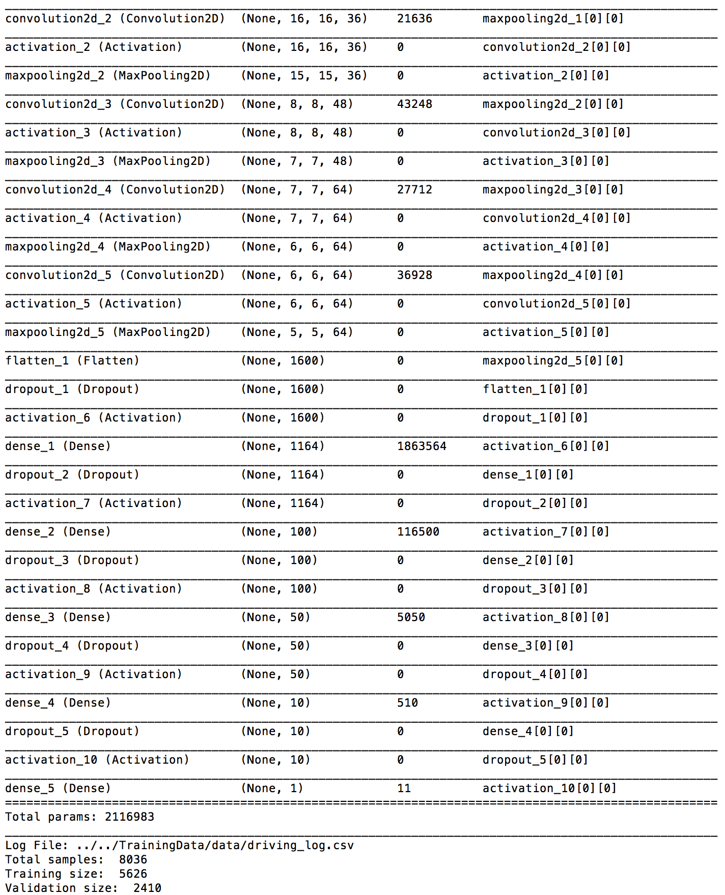
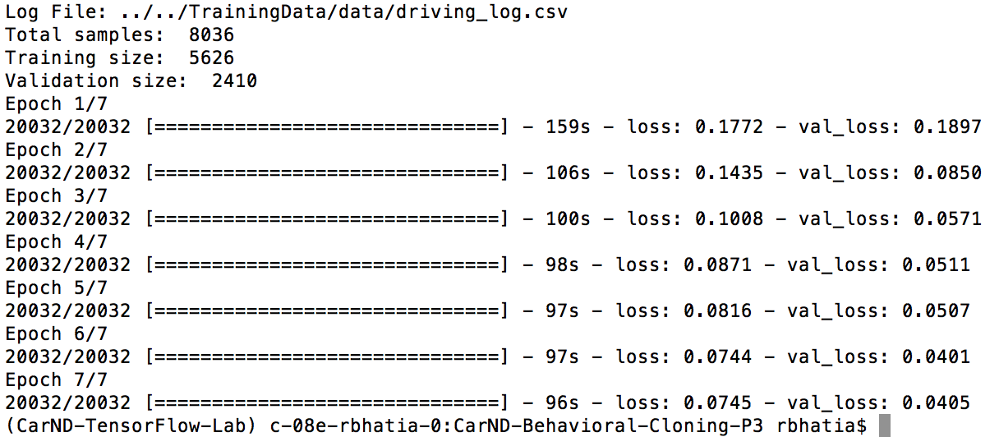

#**Behavioral Cloning** 

---

**Behavrioal Cloning Project**

The goals / steps of this project are the following:
* [x]  Use the simulator to collect data of good driving behavior
* [x]  Build, a convolution neural network in Keras that predicts steering angles from images
* [x]  Train and validate the model with a training and validation set
* [x]  Test that the model successfully drives around track one without leaving the road
* [x]  Summarize the results with a written report


[//]: # (Image References)

[image1]: ./examples/model.png "Model Visualization"

---
### Prerequisites
* Python 3.5
* [Udacity’s  CarND Term1 starter kit](https://github.com/udacity/CarND-Term1-Starter-Kit/blob/master/README.md)
* Udacity's Self Driving Car simulator


### Files Submitted & Code Quality

####1. Submission includes all required files and can be used to run the simulator in autonomous mode

My project includes the following files:
* model.py containing the script to create and train the model
* drive.py for driving the car in autonomous mode
* model.json containing a trained convolution neural network model
* model.h5 containing model weights
* writeup_report.md summarizing the results

####2. Submssion includes functional code

Training requires data generated using the simulator:
- Images under the IMG directory
- driving_log.csv file with the training data

To start the training:
* Activate the environment defined : `source activate <environment_name>`
* Ensure that the condo env is updated with the following packages
** conda install -c conda-forge flask=0.11.1
** conda install -c conda-forge eventlet=0.19.0
** conda install -c conda-forge python-socketio=1.5.1
* Train the model by running the model.py as follows
```sh
python mode1.py
```
Using the Udacity provided simulator and drive.py file, the car can be driven autonomously around the track by executing 
```sh
python drive.py model.json
```

####3. Submssion code is usable and readable

The model.py file contains the code for training and saving the convolution neural network. The file shows the pipeline I used for training and validating the model, and it contains comments to explain how the code works.

### Model Architecture and Training Strategy

#### Model Architecture

I started with a tentative architecture with 5 convolution layers and one fully connected layer. It performed with good results around the initial part of the track but was performing poorly around corners. I added some additional random layers with poor results. I decided to try a well known architecture described in [Nvidia's paper](http://images.nvidia.com/content/tegra/automotive/images/2016/solutions/pdf/end-to-end-dl-using-px.pdf). This network consists of 9 layers, including a normalization layer, 5 convolutional layers and 3 fully connected layers. The first layer of the network performs image normalization. The input data is 64 x 64. The model includes RELU layers to introduce nonlinearity and the data is normalized in the model using a Keras lambda layer.

Here is a visualization of the architecture - 

![alt text][image1]

The model contains dropout layers in order to reduce overfitting.The model was trained and validated on different data sets to ensure that the model was not overfitting. The model was tested by running it through the simulator and ensuring that the vehicle could stay on the track.The model used an adam optimizer, so the learning rate was not tuned manually. Here is the model summary - 



Training data was chosen to keep the vehicle driving on the road. I used a combination of center lane driving, recovering from the left and right sides of the road. I applied some parameters to calculate the steering correction when taking left/right camera images. The final step was to run the simulator to see how well the car was driving around track one. At the end of the process, the vehicle is able to drive autonomously around the track without leaving the road.

#### Data preprocessing

The first step to data preprocessing was removing some data points which weren't valid or would teach a bad behaviour to the network. Some data points were removed leaving the best possible only. The samples did not include data where the car is leaving the track, but only those where the car is rejoining. As part of the training pipeline itself, the images are then cropped to remove the top and bottom parts. This allows us to focus on the important part of the picture, the track itself.

#### Data augmentation

Several steps were taken to ensure the data incorporates some randomness to fill up the gaps where the training data is not enough.As already mentioned, random flipping of the image was performed. This allows to have approximately the same number of left and right turns on the training data.Random brightness changes were also introduced, so that the network can adapt to different levels of light.

Some random shearing is introduced with a probability, when the steering angle is adjusted to these random levels of shearing, we can fill up the gaps in the training data and teach the network to take sharper and shallower turns.

#### Training Process

An Adam optimizer with an initial learning rate of .0001 is used for training. First, the training data is loaded from the .csv file into memory, containing the center, left and right images and car telemetry including the steering angle.This data is then shuffled and split into training and validation set. The validation set takes up 30% of the total data.This will allow us to compare the training and validation loss and see when we need to modify our network or introduce dropout or other regularization to avoid overfitting. 
The number of samples are:

```
Total samples:  8036
Training size:  5626
Validation size:  2410
```

Python generators are used to feed Keras with batches of 64 samples, instead of loading all images into memory all at once.This also allows performing augmentation on the fly. Here are some of the training parameters -
```
learning_rate : 0.0001
number_of_epochs : 7
batch_size : 64
number_of_samples_per_epoch : 20032
validation_split : 0.3
```

Using generators with Keras allows us to artificially generate epochs with more(or less) samples than the total available training data. I decided to use 20032 samples per epoch. A smaller epoch could have possibly given finer tuning over the training.

Here is the training summary -



### Results

The model was capable to run autonoumously on the Udacity simulator’s track 1 for multiple laps. I tested for atleast 6 laps. 

Here is the animated gif showing the autonomous driving on track 1


I tested the same model on track 2 in the simulator and found that car could not complete lap 1. I suspect the training data is overfitted and collecting additional data and some further data augmentation maybe required to train the model to effectively drive on track 2.

I was able to make a video of the model working on the simulator for track 1 but did not want to load it here and had trouble uploading to youtube.

### Conclusions

It is possible to quickly train a deep convolutional neural network to learn to drive in a track from data points gathered by a person driving around it. The conditions in the simulator are very similar to what a car could possibly see in the real world, excluding unexpected obstacles and zero visibility conditions. Experimenting with different shapes and number of layers was very interesting to see the different on-track behavior of different networks after training them on the same data. Data pre-processing and augmentation was critical to navigate curves and avoid driving off tracks.  


